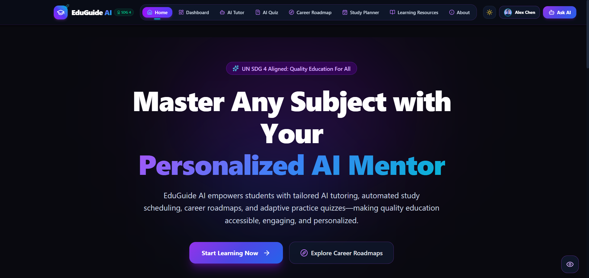
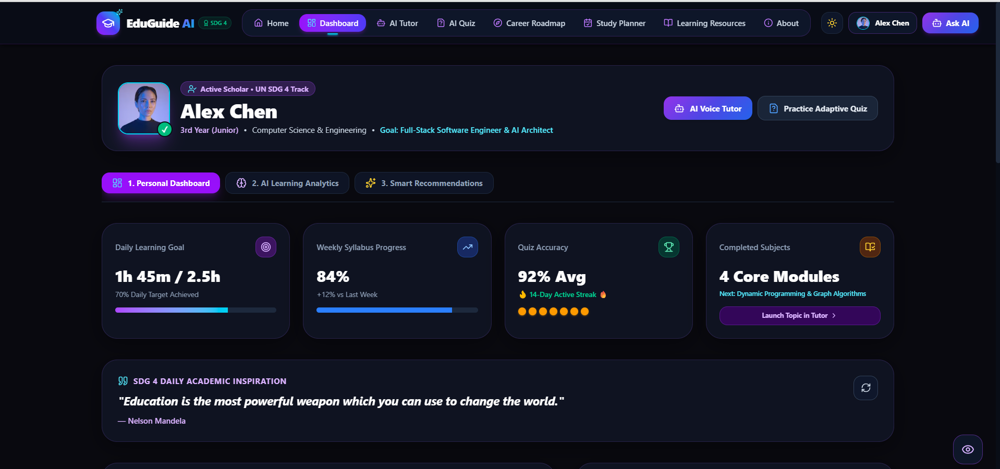

# EduGuide AI – Personalized Learning & Career Mentor 🎓

[](https://sdgs.un.org/goals/goal4)
[](https://ai.google.dev/)
[](https://www.typescriptlang.org/)
[](https://react.dev/)
[](https://tailwindcss.com/)
[](LICENSE)

**EduGuide AI** is an intelligent, full-stack personal tutor and academic career mentor platform aligned with **United Nations Sustainable Development Goal 4 (Quality Education)**. Designed specifically for university students, self-learners, and computer science & engineering scholars, EduGuide AI bridges educational gaps by providing personalized AI tutoring, dynamic adaptive quizzes, customized semester career roadmaps, exam study schedules, and curated free learning resources.

---

## 🌟 Key Features

### 🤖 1. EduGuide AI Tutor (Interactive Learning Engine)
- **Multi-Part Pedagogical Output**: Generates structured, 10-part explanations including Simple ELI5 analogies, detailed academic notes, real-world industry cases, code blueprints, common student pitfalls, technical interview questions, self-test practice problems, and exam tips.
- **Voice & Multilingual Integration**: Supports hands-free voice input via Speech Recognition and multi-language read-aloud via Text-To-Speech (TTS).
- **Personalization Controls**: Customize subject domain, learning level (Beginner to Advanced), preferred style (Practical, Conceptual, Visual), and language.

### 📝 2. AI Assessment & Practice Quiz
- **Dynamic Question Generation**: Creates multi-choice question assessments parameterized by subject, difficulty level, and question count.
- **Instant Detailed Rationale**: Provides deep academic explanations for both correct and incorrect options.
- **Interactive Score Tracker & Dashboard**: Features an active scorecard, retry options, and a **Recent Quiz History** tracker on the main dashboard.

### 🗺️ 3. Career Roadmap Engine
- **Semester-by-Semester Milestones**: Formulates custom semester career roadmaps tailored to the student's year, branch, and target role (e.g., Full-Stack Engineer, AI Architect).
- **Actionable Blueprints**: Detailed breakdown of required skills, portfolio projects, recommended learning documentation, and semester objectives.

### 📅 4. Exam Study Planner
- **Intensive Schedule Optimization**: Calculates balanced daily study timetables leading up to target exam dates based on daily time capacity.
- **Active Recall & Revision Cycles**: Blends concept review, diagnostic practice drills, flashcard passes, and break intervals.

### 📚 5. Curated Learning Resource Directory
- **100% Free Educational Hub**: Instant access to documentation, video tutorials, practice platforms, and open university lecture series.
- **Search & Filter**: Filter by category (Documentation, YouTube, Practice, Free Courses) or search by keyword.

### 📊 6. Student Dashboard & Accessibility
- **Performance Overview**: Tracks completed study hours, quiz mastery percentages, current streaks, and badge unlocks.
- **Recent Quiz History**: Locally tracks and persists completed quiz scores, timestamps, and difficulty levels.
- **Inclusive Design**: Includes a floating accessibility toolbar for high-contrast dark/light modes, scalable text sizes, and screen-reader optimizations.

---

## 🏗️ Project Directory Structure

```text
eduguide-ai/
├── .env.example              # Environment variable declarations (GEMINI_API_KEY, APP_URL)
├── metadata.json             # Application metadata and platform frame permissions
├── package.json              # Project dependencies, build, and start scripts
├── server.ts                 # Full-stack Express backend with Gemini API proxy & fallback
├── tsconfig.json             # TypeScript compiler configuration
├── vite.config.ts            # Vite configuration with React & Tailwind plugins
├── public/                   # Static public assets
└── src/
    ├── main.tsx              # Application entry point
    ├── App.tsx               # Main React container with tab navigation & theme state
    ├── index.css             # Tailwind CSS global styles
    ├── types.ts              # Global TypeScript interfaces & data models
    ├── data/
    │   └── mockData.ts       # Fallback datasets & initial mock configurations
    └── components/
        ├── Navbar.tsx        # Sticky responsive header navigation with theme toggle
        ├── Footer.tsx        # Responsive footer with SDG 4 badges & quick links
        ├── AuthModal.tsx     # Student login & guest authentication dialog
        ├── ContactModal.tsx  # Feedback & contact form modal
        ├── SearchableDropdown.tsx # Accessible portal-based searchable select dropdown
        ├── AccessibilityToolbar.tsx # Floating UI for font scaling & high contrast
        └── pages/
            ├── HomePage.tsx               # Landing overview & quick feature launchpad
            ├── DashboardPage.tsx          # Analytics, recent quiz history, and progress stats
            ├── AiTutorPage.tsx            # Multi-modal AI tutor with voice input & TTS
            ├── AiQuizPage.tsx             # Interactive assessment & score engine
            ├── CareerRoadmapPage.tsx      # Semester-by-semester career strategy tool
            ├── StudyPlannerPage.tsx       # Exam timetable generator
            ├── LearningResourcesPage.tsx  # Curated 100% free learning resource hub
            └── AboutPage.tsx              # Mission statement & UN SDG 4 details
```

---

## 🛠️ Technology Stack

- **Frontend**: React 19, TypeScript, Tailwind CSS v4, Motion (framer-motion), Recharts, Lucide React Icons.
- **Backend**: Express.js, TypeScript runtime via `tsx`, bundled with `esbuild`.
- **AI Core**: `@google/genai` (Google Gemini SDK) with model fallback retry architecture (`gemini-3.6-flash`, `gemini-flash-latest`, `gemini-3.1-flash-lite`).
- **Conversational AI**: Botpress Cloud Webchat.
- **Voice APIs**: Browser Web Speech API (SpeechRecognition & SpeechSynthesis).
- **Build Tools**: Vite 6, esbuild, TypeScript Compiler (`tsc`).

---

## ⚡ Quick Start & Installation

### Prerequisites
- **Node.js**: v18.0.0 or higher
- **npm**: v9.0.0 or higher
- **Gemini API Key**: Obtain a free key from [Google AI Studio](https://aistudio.google.com/).

### Installation Steps

1. **Clone the Repository**
   ```bash
   git clone https://github.com/your-username/eduguide-ai.git
   cd eduguide-ai
   ```

2. **Install Dependencies**
   ```bash
   npm install
   ```

3. **Configure Environment Variables**
   Create a `.env` file in the root directory (or copy from `.env.example`):
   ```env
   GEMINI_API_KEY="YOUR_ACTUAL_GEMINI_API_KEY"
   ```

4. **Run Development Server**
   ```bash
   npm run dev
   ```
   Open your browser at `http://localhost:3000` to interact with the application.

5. **Build for Production**
   ```bash
   npm run build
   ```

6. **Start Production Server**
   ```bash
   npm run start
   ```

---

## 🚀 Deployment Options

### Deploying to Vercel
1. Push your repository to GitHub.
2. Import the project in the [Vercel Dashboard](https://vercel.com).
3. Set the **Framework Preset** to `Vite` or `Other`.
4. Add the `GEMINI_API_KEY` environment variable in Vercel's project settings.
5. Deploy!

### Deploying to Google Cloud Run / Container Platforms
This repository contains a full-stack Node/Express server bundled cleanly to CommonJS (`dist/server.cjs`).
- **Build Command**: `npm run build`
- **Start Command**: `npm run start`
- **Port**: Listens on `process.env.PORT` (defaults to `3000` on host `0.0.0.0`).

---

## 🔮 Future Scope & Roadmap

- [ ] **Collaborative Study Groups**: Real-time peer study rooms powered by WebSockets.
- [ ] **Flashcard Export**: Export AI Tutor concepts directly to Anki & Quizlet decks.
- [ ] **PDF & Document Upload**: Context-aware AI tutoring directly from uploaded course syllabi or lecture slides.
- [ ] **Gamified Quizzes**: Daily streak leaderboards and global student challenges.

---

---

# 📸 Project Screenshots

## 🏠 Home Page



---

## 📊 Dashboard



---

## 🤖 AI Tutor

### AI Tutor Interface


### AI Tutor Response 1

.png)

### AI Tutor Response 2

.png)

---

## 📝 AI Quiz


---

## ✅ Quiz Evaluation


---

## 🗺️ Career Roadmap


---

## 📅 Study Planner


---

## 📚 Learning Resources


---

## 💬 Botpress AI Assistant


---

## 🌙 Dark & Light Mode


---

# ⭐ Highlights

- 🤖 AI Tutor powered by Google Gemini API
- 📝 AI-generated adaptive quizzes
- 📊 Student analytics dashboard
- 🗺️ Semester-wise career roadmap generation
- 📅 Smart AI study planner
- 📚 Curated free learning resources
- 💬 Botpress AI Assistant integrated with custom **Ask AI** button
- 🌙 Light & Dark theme support
- 🎤 Voice input & Text-to-Speech support
- ♿ Accessibility Toolbar
- 🎯 SDG 4 – Quality Education aligned

---
## 🌐 Live Demo

[https://eduguide-ai.onrender.com](https://eduguide-ai-ge47.onrender.com)
---
## 📄 License

This project is open-source and released under the **MIT License**.

---

<p align="center">

Built with ❤️ using **React, TypeScript, Express.js, Google Gemini AI & Botpress**

Supporting **United Nations Sustainable Development Goal 4 – Quality Education**

</p>
